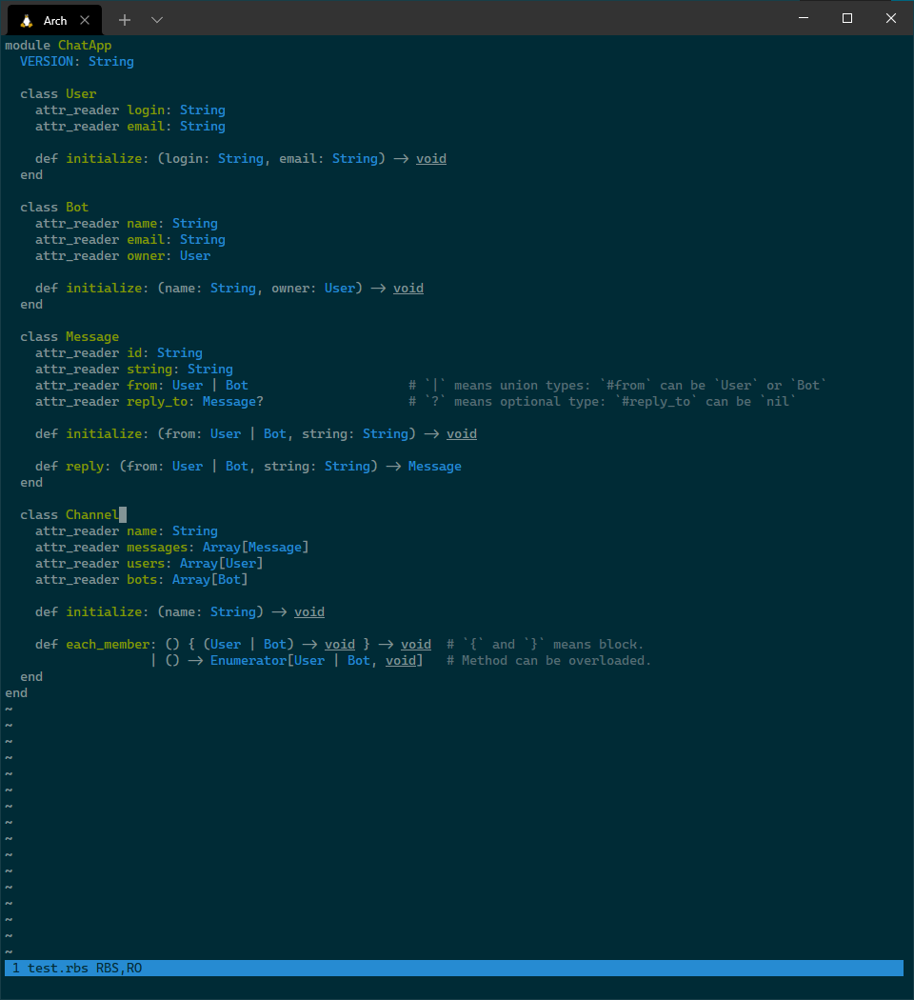

This plugin adds syntax highlighting and indentation for [Ruby Signature](https://github.com/ruby/rbs) (`*.rbs`) files.

These files are included in [my own rewrite of vim-ruby](https://github.com/jlcrochet/vim-ruby), but are listed separately here for those who want to use them alongside the original [vim-ruby](https://github.com/vim-ruby/vim-ruby).
